<div align="center">

# Codeling

**A gamified pet companion for [Claude Code](https://claude.com/claude-code).**
The more you code, the more your pet grows.

[](LICENSE)
[](https://github.com/tdodd777/Codeling/releases)
[](https://www.electronjs.org/)
[](https://opentelemetry.io/)

<br />

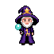

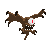

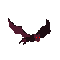
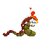
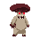

</div>

<br />

<!-- TODO: replace with a real hero screenshot of the tray panel -->
<p align="center">
  
  <br />
  <sub><i>Add hero screenshot at <code>docs/screenshots/hero.png</code></i></sub>
</p>

---

## Overview

Codeling lives in your **menu bar** (macOS) or **system tray** (Windows / Linux) and turns your Claude Code sessions into XP. Every prompt you send feeds your pet. Level up, spin the wheel, unlock new species, decorate your shelf.

Under the hood it's a love letter to indie pixel-pet games (Tamagotchi, Neopets, the desktop companions of the late 90s), wired up to an OpenTelemetry pipeline that consumes Claude Code's emitted metrics in real time. No accounts, no cloud, everything lives on-device.

## Features

- **14 species to collect**: hand-picked pixel art with full idle / run / attack / hurt / death animations
- **OTLP telemetry**: local OpenTelemetry receivers (HTTP + gRPC) parse Claude Code's metric stream and convert it into XP and bits
- **Spin wheel + shop**: every 50 messages earns a spin; spend bits on new species and animation unlocks
- **Achievements + daily streaks**: milestone notifications and a daily-summary popup
- **Live-tunable economy**: XP / bit / spin rules editable from the Settings panel without a restart
- **Save export/import**: full snapshot in/out as a single JSON file
- **100% local**: no analytics, no account, no cloud sync. SQLite on your disk.

## Quickstart

Requires **Node 18+** and a working [Claude Code](https://claude.com/claude-code) install.

```bash
npx codeling install
```

That one command:

1. Downloads the right installer for your OS from the latest [GitHub Release](https://github.com/tdodd777/Codeling/releases) and runs it (`.exe` on Windows, `.dmg` on macOS, `.deb` / `.rpm` on Linux)
2. Sets the user-scope OTEL env vars so every Claude Code session feeds Codeling's receiver
3. Installs a `Stop` hook in `~/.claude/settings.json` as a per-turn message-count backup

Restart your shell (IDEs too) so the env vars propagate, then send a message in Claude Code and watch your pet level up.

> **First-launch warning**: until paid signing certs are wired, an "unidentified developer" / "publisher unknown" prompt appears on first launch. Dismiss it once and subsequent launches are silent.

Need staged installs? Use `--skip-app`, `--skip-otel`, or `--skip-hook`.

```bash
npx codeling status      # show env vars + Stop hook + platform
npx codeling uninstall   # remove telemetry + Stop hook
```

## Screenshots

<!-- TODO: drop UI screenshots into docs/screenshots/ as you capture them -->

<table>
  <tr>
    <td align="center">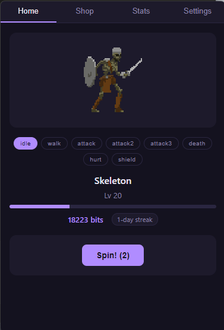<br /><sub><b>Home</b>: pet, level, XP, bits, spin progress</sub></td>
    <td align="center">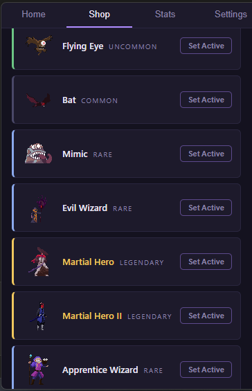<br /><sub><b>Shop</b>: spend bits on species & animations</sub></td>
    <td align="center">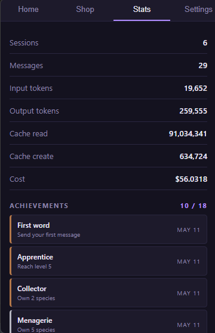<br /><sub><b>Stats</b>: tokens, streaks, achievements</sub></td>
  </tr>
</table>

## The roster

All 14 species ship bundled with the installer. No downloads, no extra setup. Pick yours from the Shop once you've unlocked it.

<table>
  <tr>
    <td align="center"><br /><sub><b>Wizard</b></sub></td>
    <td align="center"><br /><sub><b>Slime</b></sub></td>
    <td align="center"><br /><sub><b>Flying Eye</b></sub></td>
    <td align="center"><br /><sub><b>Bat</b></sub></td>
    <td align="center"><br /><sub><b>Mimic</b></sub></td>
    <td align="center">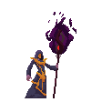<br /><sub><b>Evil Wizard</b></sub></td>
    <td align="center"><br /><sub><b>Fire Worm</b></sub></td>
  </tr>
  <tr>
    <td align="center">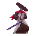<br /><sub><b>Martial Hero</b></sub></td>
    <td align="center">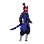<br /><sub><b>Martial Hero 2</b></sub></td>
    <td align="center">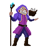<br /><sub><b>Apprentice Wizard</b></sub></td>
    <td align="center">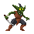<br /><sub><b>Goblin</b></sub></td>
    <td align="center">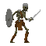<br /><sub><b>Skeleton</b></sub></td>
    <td align="center"><br /><sub><b>Mushroom</b></sub></td>
    <td align="center">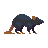<br /><sub><b>Rat</b></sub></td>
  </tr>
</table>

## How it works

```
   Claude Code
        │
        │  OTLP (HTTP :4318 or gRPC :4317)
        ▼
┌──────────────────────────────────────┐
│  Codeling receivers                  │
│    ↓                                 │
│  Aggregator                          │
│    • claude_code.token.usage  → tokens
│    • event.name=user_prompt   → messages
│    ↓                                 │
│  Economy → XP / bits / spins         │
│    ↓                                 │
│  SQLite (better-sqlite3)             │
│    ↓                                 │
│  React panel (menubar tray)          │
└──────────────────────────────────────┘
```

- **Telemetry**: Codeling runs OTLP receivers on `127.0.0.1:4318` (HTTP) and `127.0.0.1:4317` (gRPC). Claude Code emits to either when the OTEL env vars are set; HTTP is the default.
- **Economy**: `src/main/economy.ts` converts ingested events into XP and bits. Defaults live in `ECONOMY_RULE_DEFAULTS`; overrides go in the `meta` table and are editable live from the Settings tab.
- **State**: all on-device in SQLite:
  - Windows: `%APPDATA%\Codeling\codeling.db`
  - macOS: `~/Library/Application Support/Codeling/codeling.db`
  - Linux: `~/.config/Codeling/codeling.db`

The Stop hook in `~/.claude/settings.json` is a backup per-turn tally. If an OTLP event drops, the message count stays correct.

<details>
<summary><b>Manual env vars</b> (if you'd rather configure telemetry yourself)</summary>

```
CLAUDE_CODE_ENABLE_TELEMETRY=1
OTEL_EXPORTER_OTLP_ENDPOINT=http://127.0.0.1:4318
OTEL_EXPORTER_OTLP_PROTOCOL=http/protobuf
OTEL_METRICS_EXPORTER=otlp
OTEL_LOGS_EXPORTER=otlp
OTEL_METRIC_EXPORT_INTERVAL=10000
```

</details>

## Uninstall

```bash
npx codeling uninstall   # removes telemetry env vars + Stop hook
```

The app itself uninstalls through the OS:

- **Windows**: *Add or Remove Programs*
- **macOS**: drag to Trash
- **Linux**: `apt remove codeling` or `rpm -e codeling`

## Roadmap

### Known limitations

- **Unsigned builds.** First-launch "publisher unknown" (Windows) / "unidentified developer" (macOS) prompt until paid code-signing certs land. Dismiss once and subsequent launches are silent.
- **Stop-hook vs OTLP race.** With the Stop hook installed, OTLP `user_prompt` and the hook can race; very occasionally a turn gets counted twice. Fix shapes tracked in `DIRECTION.md` → Open questions.
- **DELTA-temporality OTLP only.** Codeling expects DELTA temporality (which is what Claude Code emits today). If the source ever switches to CUMULATIVE, the aggregator warns and drops the data point.

### Coming up

- **First published release.** Cut a release via `npm run publish` (uploads to GitHub Releases) and flip `private: false` in `package.json` so `npx codeling install` resolves end-to-end. Currently the CLI downloads from a release that doesn't exist yet.
- **Code signing.** Apple Developer ID + notarization for macOS; Authenticode for Windows. Placeholders are commented in `forge.config.ts`.
- **Additional package channels.** Homebrew cask, Scoop manifest, Winget submission.
- **More species.** Additional CC0 candidates archived under `assets/sources/luizmelo/` — drop them through `scripts/luizmelo-slice.py`.
- **Polish.** Spin-reveal animation pass; 8-directional rendering on the panel; starter-selection silhouette reveal on first launch; animation-pricing tuning post-playtest.

## Development

```bash
git clone https://github.com/tdodd777/Codeling.git
cd Codeling
npm install
npm run setup    # telemetry + Stop hook only (same as install --skip-app)
npm start        # Forge dev: Vite HMR + hot main-process reload
```

`npm start` is the full dev loop: Vite HMR for the renderer, hot main-process reload on save. Type `rs` in the terminal to force a restart.

| Script | What |
|---|---|
| `npm start` | Forge dev: Vite HMR for renderer + hot main reload |
| `npm run lint` | TypeScript type check (`tsc --noEmit`) |
| `npm test` | Run vitest (pure-logic suites); `npm run test:watch` for watch mode |
| `npm run package` | Forge package: unpacked binary |
| `npm run make` | Forge make: full installers (Squirrel / DMG / DEB / RPM) in `out/make/` |
| `GITHUB_TOKEN=… npm run publish` | Forge publish: uploads installers to GitHub Releases as a draft |

### Project layout

```
src/
├── main/            Electron main process
│   ├── db/          SQLite client + schema + repos
│   ├── otel/        OTLP receivers, decoders, aggregator
│   ├── economy.ts   XP / Bits / level / spin rules
│   ├── sprites.ts   PixelLab-format sprite manifest builder
│   └── index.ts     Entry: menubar setup, lifecycle, tray animation
├── preload/         contextBridge surface (window.codeling.*)
├── renderer/        React panel (Home / Shop / Stats / Settings)
└── shared/          IPC contract types

assets/sprites/<species>/    Per-species sprite folders (bundled)
scripts/                     Install/uninstall CLI + sprite slicer
proto/                       Vendored OTLP collector .proto files
```

## Contributing

Contributions welcome. Common paths:

- **Add a species.** Drop a sprite folder under `assets/sprites/<species>/` matching the existing layout (`rotations/south.png` as the static fallback, `animations/<Name>/south/frame_NNN.png` for each animation — the folder name is matched against keywords: `idle`/`breath`, `run`, `walk`, `attack`). Add the key to the `Species` union and `SPECIES_CATALOG` in `src/shared/types.ts`; optionally tune the head-crop fraction in `TRAY_HEAD_FRACTION` (`src/main/index.ts`). Bar for inclusion: rich animation (≥6 frames per anim, ≥3 distinct animations). Acceptable licenses: **CC0**, **CC-BY** (with attribution in `assets/sources/<creator>/NOTICE.md`), **MIT**. Reject anything with **SA / NC / ND / GPL** clauses — copyleft / non-commercial restrictions are incompatible with this repo's MIT license. LuizMelo packs ship one PNG per animation as a horizontal strip; slice via `scripts/luizmelo-slice.py` (extend the `SPECIES` dict and re-run).
- **Tune the economy.** Defaults in `src/main/economy.ts`. Open an issue or PR with the proposed delta and the reasoning.
- **Distribution polish.** Code signing, packaging smoke tests, additional channels — see *Roadmap* above.

For larger changes, open an issue first. The dated decision log in [`DIRECTION.md`](DIRECTION.md) captures the *why* behind current choices.

## Acknowledgments

Codeling builds on the work of pixel artists who release under permissive licenses. Every sprite in the roster is either CC0 or generated from pixellab:

- **[LuizMelo](https://luizmelo.itch.io/)**: 12 of 14 species (Flying Eye, Bat, Mimic, Evil Wizard, Fire Worm, Martial Hero, Martial Hero 2, Apprentice Wizard, Goblin, Skeleton, Mushroom, Rat). Carries the CC0-with-rich-animation niche on itch.io.
- **[rvros](https://rvros.itch.io/pixel-art-animated-slime)**: the slime.
- **[PixelLab](https://pixellab.ai/)**: the original wizard.

Per-source license details live in `NOTICE.md` files under `assets/sources/`.

## License

[MIT](LICENSE) © Tyler Dodd
